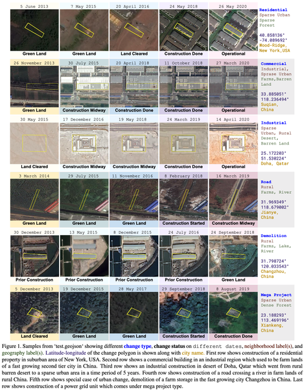

# Classification_Of_Geospatial_Data

## Introduction
Using multiple images taken over time from satellites help us see how the world is changing. This challenge uses features from these images to understand what's happening globally. Computer techniques to process this data have been used, and now another approach suggests using Machine Learning. This is the core of the project.

**Ranked #2 — 2024/02/17**  
[Kaggle Competition: 2EL1730 Machine Learning Project (January 2024)](https://www.kaggle.com/competitions/2el1730-machine-learning-project-january-2024)  

## How to recompute everything

This file can be used to install necessary packages in an environment using the command :
pip install -r requirements.txt

The notebooks are ordered from 1 to 15 (and optional notebooks from 100)

### Feature extraction
1) Download train.geojson and test.geojson, and put them in data/train.geojson and data/test.geojson
2) Execute the notebook 1-Feature_extraction.ipynb
3) OPTIONAL (Very long, precomputed files are saved) - The notebooks 2,3,4,5,6 have to be executed given the instruction at the beginning of each notebook. BUT it requires a lot of time (around 20 hours), so the computed files are given
4) Execute the notebook 7-Construction.ipynb

### Training
5) OPTIONAL - Run the notebook that corresponds to each model: 8-XGBoost_13, 9-XGBoost_17, 10-LightGBM, 11-CatBoost, 14-XGBoost_15,
or use the precomputed results that are already available

### Generate result
6) Run 15-Ensemble.ipynb, by specifying the corresponding coefficients.

## Objective
The primary objective of this project is to classify geographic areas based on their features using robust Machine Learning model capable of distinguishing between six different classes.

  

## Pipeline
The given Data was first structured, ordered and cleaned, in an appropriate form. New variables were also created, some very useful for the algorithm predictions. Multiple models have been tested, such as XGBoost, LightGBM, CatBoost, k-NN, Random Forest, SVM and even CNN. 
A resume about the main results of these models is explained in the report.

## Team Pain au Chocolat  

**Team Members:**
- AL BOUZIDI Elias
- DENG Erwin      
- ALAMI Nabil  

*2EL1730 - Machine Learning, CentraleSupélec*  

